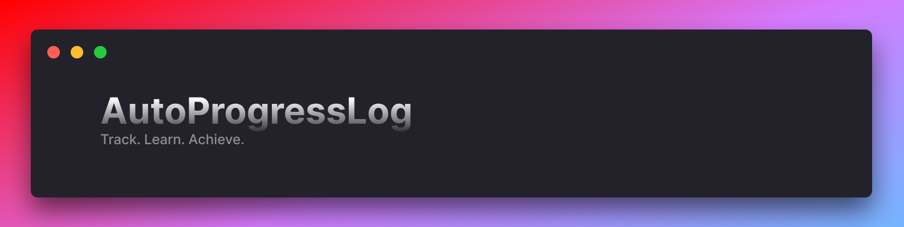

## Introduction
This projects aims to be a ressource for the [refold discord servers](https://refold.la/join/). Some people spend countless hours logging their immersion time, immersion streaks and anki streaks. This terminal-based utility aims to create an easy to use way to automate this process.

As well as simplifying the process of logging, this tool gamifies the process of language learning by tracking your statistics as well as giving you a score for all of your hard work and time put into language learning.

## Features

* ⏰ Automatic immersion tracking and formatting with Toggl Track
* ⭐ Integration with Anki to keep track of total cards seen
* 🤖 Server "automatic" mode and manual mode
* 📄 Output to terminal and to file
* 🤓 Compatibility with [Bun](https://bun.sh/) and [NodeJS](https://nodejs.org/en)

## Installation

This project is compatible with [Bun](https://bun.sh/) and [NodeJS](https://nodejs.org/en). If you don't have any, [NodeJS](https://nodejs.org/en) is strongly recommended for new users.


#### If you're using NodeJS / npm (recommended)
```bash
git clone https://github.com/AlooTheAloo/AutoProgressLog
cd AutoProgressLog
npm i
npm run config
```

#### If you're using bun
```bash
git clone https://github.com/AlooTheAloo/AutoProgressLog
cd AutoProgressLog
bun i
bun run config
```

## Upgrading
There is an automatic upgrade script available. 
If you're upgrading from a previous version, simply place the `cache` folder in the new folder and run ```npm run upgrade```.


## Configuration

#### What's the difference between manual and server modes?
Manual mode will run the logger every time you run the program. It will generate one report and then close itself. This is useful when you are running the logger on your own home computer.

Server mode will run the logger at a specified time of the day every day. The program will run and be on standby until the time of day specified, run the logger, and then go back to being on standby. This is useful when you are running the logger on a home server.

#### Getting your toggl Track token
If you don't already have an account, [please make one before proceeding](https://toggl.com/). \
Your API key is available at the bottom of [your profile page](https://track.toggl.com/profile)

#### Anki database path

According to the [anki documentation](https://docs.ankiweb.net/files.html#:~:text=On%20Windows%2C%20the%20latest%20Anki,Anki%20in%20your%20Documents%20folder)
```
On Windows, the latest Anki versions store your Anki files in your appdata folder. 
You can access it by opening the file manager, and typing %APPDATA%\Anki2 in the location field. 
Older versions of Anki stored your Anki files in a folder called Anki in your Documents folder.

On Mac computers, recent Anki versions store all their files in the ~/Library/Application Support/Anki2 folder. 
The Library folder is hidden by default, but can be revealed in Finder by holding down the option key while clicking on the Go menu. 
If you're on an older Anki version, your Anki files will be in your Documents/Anki folder.

On Linux, recent Anki versions store your data in ~/.local/share/Anki2, or $XDG_DATA_HOME/Anki2 if you have set a custom data path. 
Older versions of Anki stored your files in ~/Documents/Anki or ~/Anki.
```
The database file will usually be named 'collection.anki2' 

#### Anki app path
This is where your anki app is stored. 

On Windows, you can find it by searching for the app in the windows search menu, right-clicking on the app and pressing "open file location" repeat this until you have the anki.exe app. This is the app path. 

On MacOS, you can find it by searching for the app in spotlight search and pressing `⌘` + `Enter`. This will highlight the app.

On Linux, figure it out lol idk 🤷

Once you provide this path, anki will launch. Once launched, the configuration script will ask you which one of many processes is anki. Find the process that most closely matches the anki process and enter the corresponding number.

#### 
## Limitations
This has only been tested on Windows and MacOS, if you have issues on other operating systems, skill issue lmao.

Anki integration will only work on computers with a graphical desktop environment, meaning you cannot run this on a CLI-only server (though a docker-compatible release is in the works).

## Contributing
We truly appreciate your interest in contributing! However, we encourage you to focus on spending your time on immersion and making progress. If you have a quick, simple suggestion or improvement, we’d love to hear it. Otherwise, leave the heavy lifting to us 💪 
