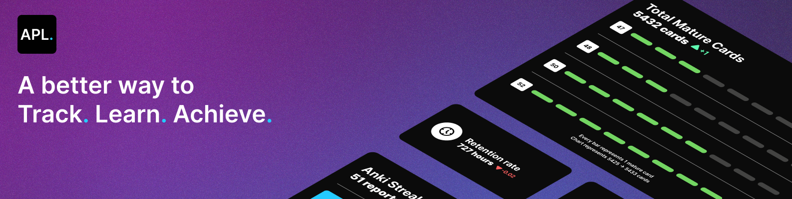
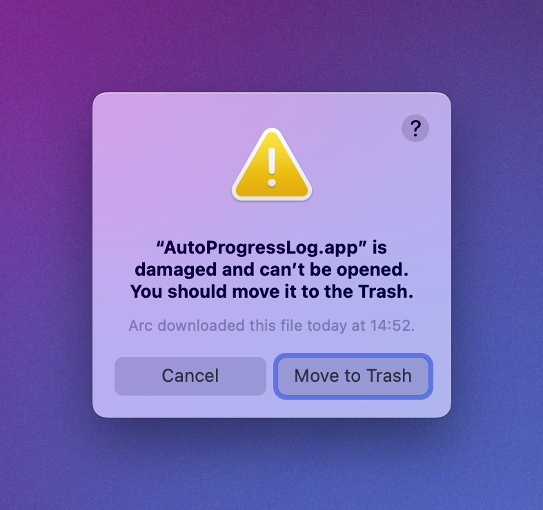

## Introduction

This projects aims to be a ressource for immersion language learners. Some people spend countless hours logging their immersion time, immersion streaks and anki streaks. This utility aims to create an easy to use and simple way to automate this process.

As well as simplifying the process of logging, this tool gamifies the process of language learning by tracking your statistics as well as giving you a score for all of your hard work and time put into language learning.

## Features

- Automatic immersion tracking with Toggl Track
- Integration with Anki to keep track of total reviews, retention rate, and mature cards !
- Integration with Discord's RPC to show your gains to your friends
- Visualisation of your language learning progress
- Generation of awesome-looking reports


## Installation

### Windows guidelines

As APL is unsigned on windows, you will need to **bypass windows smartscreen** to run the app.

### MacOS guidelines

MacOS will throw a warning at you when first trying to install the application.



Open a terminal and enter the following command to get rid of it.

```
sudo xattr -cr /Applications/AutoProgressLog.app
```

When launching the app, you will be required to authorize APL access to your screen. This is used to track the synchronisation process with anki.
If you're on MacOS 15 Sequoia or later, you will need to revalidate this every month.

### Linux guidelines

> [!CAUTION]
> Linux is malware. Please consider upgrading to MacOS for an optimal experience.

Most of the automagic connections will not work on linux or will only work on very few distros, you will have to manually connect to anki and toggl.
Anki connection may not work on some window managers like i3.

## Configuration

#### Getting your toggl Track token

Your API key is available at the bottom of [your profile page](https://track.toggl.com/profile)

#### Anki database path

According to the [anki documentation](https://docs.ankiweb.net/files.html#:~:text=On%20Windows%2C%20the%20latest%20Anki,Anki%20in%20your%20Documents%20folder)

```
On Windows, the latest Anki versions store your Anki files in your appdata folder.
You can access it by opening the file manager, and typing %APPDATA%\Anki2 in the location field.
Older versions of Anki stored your Anki files in a folder called Anki in your Documents folder.

On Mac computers, recent Anki versions store all their files in the ~/Library/Application Support/Anki2 folder.
The Library folder is hidden by default, but can be revealed in Finder by holding down the option key while clicking on the Go menu.
If you're on an older Anki version, your Anki files will be in your Documents/Anki folder.

On Linux, recent Anki versions store your data in ~/.local/share/Anki2, or $XDG_DATA_HOME/Anki2 if you have set a custom data path.
Older versions of Anki stored your files in ~/Documents/Anki or ~/Anki.
```

The database file will usually be named 'collection.anki2'

#### Anki app path

This is where your anki app is stored.

On Windows, you can find it by searching for the app in the windows search menu, right-clicking on the app and pressing "open file location" repeat this until you have the anki.exe file. This is the app path.

On MacOS, you can find it by searching for the app in spotlight search and pressing `⌘` + `Enter`. This will highlight the app.

On Linux, the path is different depending on your distribution and installation method.

Once you provide this path, anki will launch. Once launched, the configuration script will ask you which one of many processes is anki. Find the process that most closely matches the anki process and enter the corresponding number.

####

## Limitations

This has only been tested thoroughly on Windows and MacOS, linux support is running on best-effort.

This app will only work on computers with a graphical desktop environment, meaning you cannot run this on a CLI-only server.

## Contributing

We truly appreciate your interest in contributing! However, we encourage you to focus on spending your time on immersion and making progress. If you have a quick, simple suggestion or improvement, we’d love to hear it. Otherwise, leave the heavy lifting to us 💪
