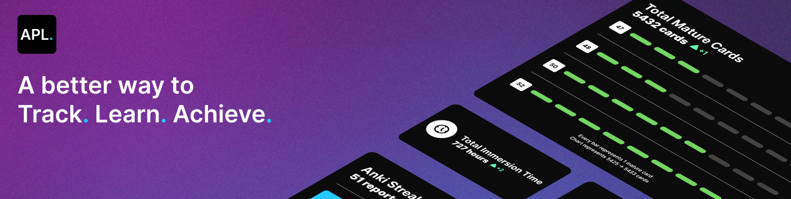

## Introduction

This projects aims to be a ressource for immersion language learners. Some people spend countless hours logging their immersion time, immersion streaks and anki streaks. This utility aims to create an easy to use and simple way to automate this process.

As well as simplifying the process of logging, this tool gamifies the process of language learning by tracking your statistics as well as giving you a score for all of your hard work and time put into language learning.

## Features

- Automatic immersion tracking with Toggl Track
- Integration with Anki to keep track of total reviews, retention rate, and mature cards !
- Integration with Discord's RPC to show your gains to your friends
- Visualisation of your language learning progress
- Generation of awesome-looking reports


## Installation

### Windows guidelines

As APL is unsigned on windows, you will need to **bypass windows smartscreen** to run the app.

### MacOS guidelines

MacOS will throw a warning at you when first trying to install the application.


Open a terminal and enter the following command to get rid of it.

```
sudo xattr -cr /Applications/AutoProgressLog.app
```

### Linux guidelines

> [!CAUTION]
> Linux is malware. Please consider upgrading to MacOS for an optimal experience.

You need the libvips library to use APL.

**Debian**
```
sudo apt install libvips
```
**Arch**
```
sudo pacman -s libvips
```
**Fedora**
```
sudo dns install vips
```

## Configuration

#### Getting your toggl Track token

Your API key is available at the bottom of [your profile page](https://track.toggl.com/profile)

## Limitations

This has only been tested thoroughly on Windows and MacOS, linux support is running on best-effort.

This app will only work on computers with a graphical desktop environment, meaning you cannot run this on a CLI-only server.

## Contributing

We truly appreciate your interest in contributing! However, we encourage you to focus on spending your time on immersion and making progress. If you have a quick, simple suggestion or improvement, we’d love to hear it. Otherwise, leave the heavy lifting to us 💪
